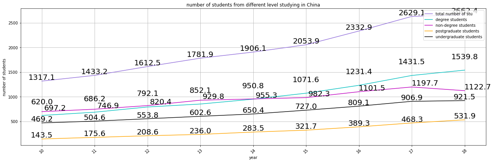
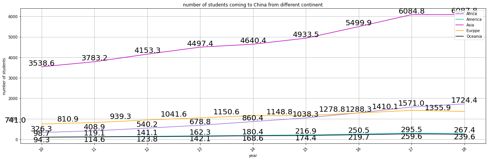
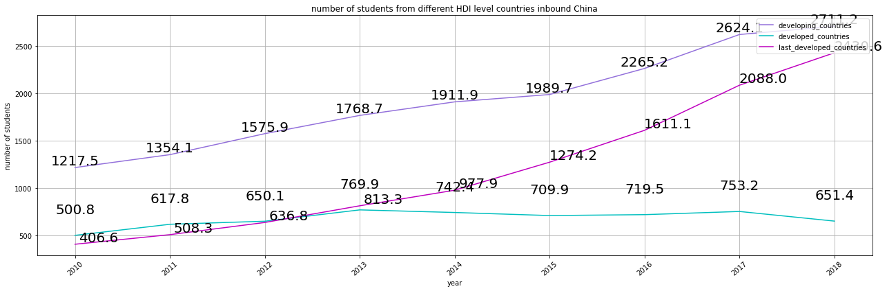
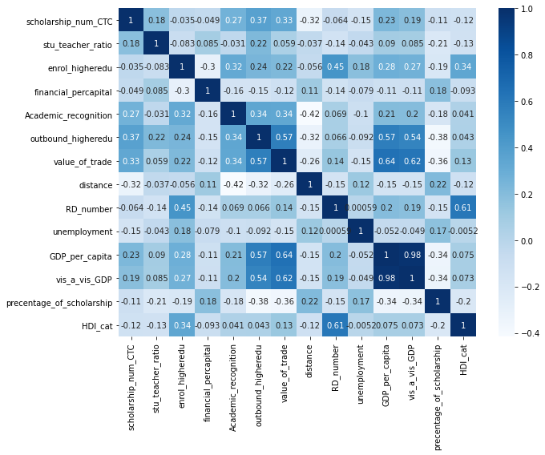
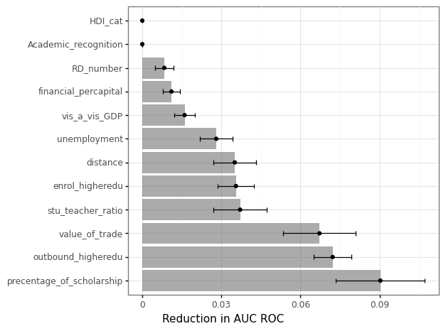
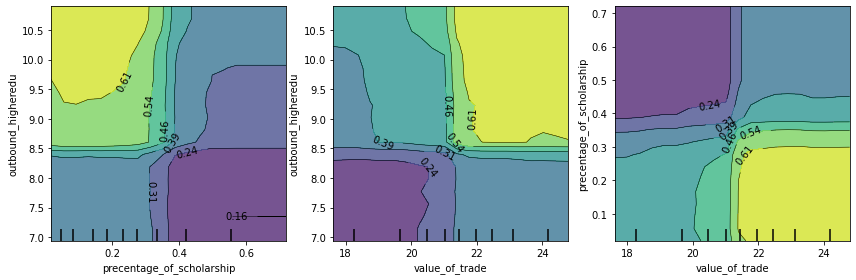
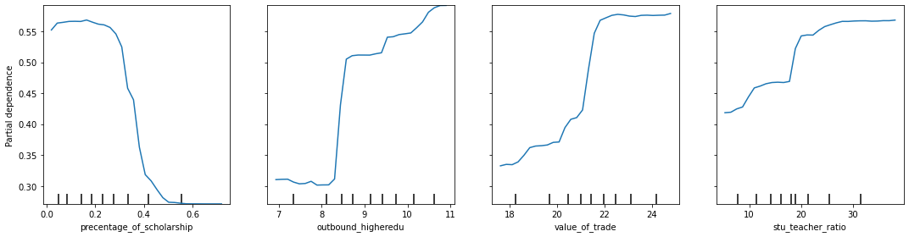

# Machine Learning Analysis of International Student Mobility: A Case Study of China

## Introduction
The phenomenon of international student mobility is intensifying with the advancement of globalization. This project aims to identify and predict the factors influencing the mobility of international students, focusing on the influx into China for higher education. China's growing prominence in higher education and its expanding global influence make it an exemplary case for studying this trend.

This report is structured to first establish the context and objectives of the research. It begins with a background and problem statement, followed by a detailed discussion of the data sources and methodologies employed, including data visualization and machine learning techniques. The subsequent sections present the findings and propose directions for future research. 

## Problem Statement and Background
The global mobility of students reached 4.1 million in 2013, with numbers rising annually. The pattern of international student mobility is evolving, characterized by a surge in student numbers and an imbalance between sending and receiving countries, predominantly from developing to developed nations.

Scholarship in this field is twofold, encompassing both micro and macro perspectives. At the micro level, research by Geoffrey N. Soutar and Julia P. Turner highlighted the impact of cultural and institutional factors, while Lawson Savery emphasized the role of social connections. Macro-level analyses have applied the push-pull theory, as introduced by D.J. Bagne, to examine the broader determinants of student mobility. Notably, studies by Philip G. Altbach and Mary E. McMahon have explored economic, educational, and political influences, while Tse M. Chen and George A. Barnett employed network analysis to understand the economic correlations affecting mobility.

The central research question investigates the factors contributing to the mobility of international students to China. This includes an analysis of the demographic and academic profiles of students in China and the distribution of their countries of origin. A Random Forest model is utilized to assess the impact of factors like academic reputation and bilateral trade on the influx of students to China.

## Data
The dataset encompasses observations from 141 countries starting in 2010, analyzed on a country-year basis. Data management and analysis were conducted using pandas in Python, with country names standardized via the country-converter package. This study focuses on Belt and Road (B&R) countries, chosen for their stable diplomatic ties with China, which helps isolate diplomatic factors affecting student mobility.

### Dependent variable
The dependent variable is the number of international students in China pursuing higher education, derived from the Concise Statistics of International Students Coming to China (2010-2018). The data, manually collected from paper files, includes the count of degree-seeking and non-degree-seeking students from all countries represented in China's tertiary education sector.

### Independent Variables
This study meticulously selects independent variables, incorporating both predictors and control factors, aligned with the Push-Pull Theory to analyze international student mobility to China. These variables, sourced from authoritative online databases, encapsulate the economic status, social advancement, and the educational quality and capacity of a nation, which are pivotal in influencing students' decisions to pursue education in China. Educational indicators such as the student-teacher ratio, higher education enrollment ratio, and financial investment per higher education student were chosen to reflect the educational system's quality and a country's developmental level. The inclusion of R&D researchers per million people and GDP per capita serves as indicators of a nation's societal and economic maturity, respectively. The Human Development Index (HDI), provided by the United Nations Development Programme (UNDP), categorizes Belt and Road (B&R) countries into three tiers: developing, developed, and least developed, to further refine the analysis.

In assessing push factors, the study delves into variables that illustrate the interplay between China and the B&R countries, encompassing economic collaboration, geographic proximity, trade volume, and academic acknowledgment. Data on scholarship allocations from China, extracted from the Concise Statistics of International Students Coming to China (2010-2018), highlights China's educational allure. The examination of mutual academic recognition agreements and trade values quantifies the educational and economic connectivity with China, while geographic distance elucidates the preference for proximity due to cultural affinities.

The data management process commenced with the collection and standardization of data, ensuring consistent country nomenclature. This was followed by the integration of datasets based on uniform country names, excluding nations with significant data voids. The data were methodically stored and managed using SQLite. To elucidate economic disparities, the GDP per capita of the countries was normalized against China's GDP per capita. A binary HDI variable was constructed by amalgamating the least developed and developing countries into a single category, where '1' signifies developed countries, and '0' indicates less developed nations, enabling a focused examination of how development status influences student mobility trends to China.

## Analysis

In the preliminary phase of the analysis, I applied comprehensive data preparation techniques, including feature engineering, to refine the variables for more insightful analysis. This process involved adjusting the GDP per capita of Belt and Road Initiative (B&R) countries relative to China's GDP per capita, highlighting the economic disparities between the nations. Similarly, I refined the variable representing the ratio of students in China on government scholarships to the total number of inbound students from respective countries. The data wrangling efforts culminated in a dataset comprising 1,179 entries spanning from 2010 to 2018.

Utilizing visualization techniques was a pivotal aspect of the project, aiding in both exploratory data analysis and the effective communication of model outcomes. The exploratory analysis focused on the 2018 data to provide a contemporary overview of the distribution of international students' countries of origin. I employed visualization tools to facilitate a nuanced understanding of the data, laying the groundwork for further analysis.


```{r inbound based on countries, fig.align = 'center', out.width = "75%", fig.cap = "This figure presents the distribution of international students by country of origin in China for the year 2018. The analysis reveals that the top five countries contributing to the student population in China are Pakistan, Korea, Thailand, Bangladesh, and the Lao People's Democratic Republic. Notably, these nations are geographically proximate to China, indicating a regional trend in student mobility. Furthermore, the data indicates a predominance of students from Asian countries, in contrast to a comparatively lower representation from countries in the Americas and Oceania.",echo=FALSE}

```


```{r inbound trend of different study level, fig.align = 'center', out.width = "75%", fig.cap = "This figure illustrates a significant upward trajectory in the number of international degree-seeking students in China, highlighting a robust and continuous growth pattern. The data further delineates a consistent annual rise in the enrollment of postgraduate and undergraduate international students, underscoring a sustained expansion across different levels of higher education.",echo=FALSE}

```

```{r inbound trend of different continents, fig.align = 'center', out.width = "75%", fig.cap = "This figure illustrates the distribution of international students in China by continent. It indicates that Asia is the leading source of international students in China, followed by Europe and then Africa. Conversely, the continents of America and Oceania contribute the fewest number of students.",echo=FALSE}

```

```{r inbound based on countires of different HDI level, fig.align = 'center', out.width = "75%", fig.cap = "This figure presents an analysis of the origins of international students in China, segmented by the level of economic development in their home countries. It indicates that students from developing nations constitute the largest demographic enrolling in Chinese educational institutions. In contrast, students from the least developed countries, while fewer in number, exhibit the fastest growth rate in terms of enrollment figures. Conversely, the influx of students from developed countries to China is the most modest, with the data suggesting a stagnation in growth trends for this group.",echo=FALSE}

```

```{r corr, fig.align = 'center', out.width = "75%", fig.cap = "This figure shows the correlation between my independent variables.",echo=FALSE}

```


I conducted a correlation analysis using the Seaborn library to ascertain the interdependencies among predictor variables, ensuring minimal collinearity. The subsequent phase involved deploying Scikit-learn's machine learning algorithms to address regression and classification challenges. The regression analysis treated the dependent variable as continuous, applying Ordinary Least Squares (OLS) regression, K-Nearest Neighbors (KNN), Decision Trees, and Random Forests. For classification, the dependent variable was segmented based on the data mean, employing KNN, logistic regression, and Random Forests for analysis.

Prior to regression, the dataset underwent transformation to address categorical data and skewed distributions, including a logarithmic adjustment for skewed variables and normalization to standardize the data scale. I categorized countries into developed and developing, based on UNDP classifications, enhancing the model's interpretative value. The model refinement process involved splitting the dataset, tuning hyperparameters, and optimizing the models through GridSearchCV to maximize predictive accuracy, employing AUC ROC and R-squared for regression, and Mean Squared Error (MSE) and R-squared for classification evaluations.

Upon finalizing the estimators, I constructed a predictive pipeline, testing the model against a separate data set to evaluate its predictive accuracy. The model also underwent a feature permutation process to identify the relative importance of each variable, providing insights into their respective impacts on the dependent variable, the number of international students in China for higher education. This analysis was instrumental in identifying key factors influencing student mobility to China.

## Results
The initial phase of the research involved executing multiple models, focusing on data from Asian and African countries due to their data richness. The preliminary results, indicated by high Mean Squared Error (MSE) values, suggested that the selected features were insufficiently predictive within the analytical framework. The homogeneity within continental datasets—reflecting similarities in geographical proximity to China and socio-economic conditions—limited the model's learning potential. To enhance the model's predictive capability, I subsequently integrated all available observations into the model training process.

Among various models tested, the K-Nearest Neighbors (KNN) model, with a specification of 10 neighbors, emerged as the most effective. This model, when applied to the test dataset, achieved an R-squared value of 0.79 and an MSE of 0.682. This indicates a substantial degree of accuracy, with an average deviation of 0.682 units between the predicted and actual values, underscoring the effectiveness of the selected variables in forecasting the influx of international students to China.

The Random Forest classifier, with a maximum depth of 6, stood out in the classification model category. This model demonstrated excellent performance on the test data, achieving an accuracy score of 0.97 and a Receiver Operating Characteristic Area Under the Curve (ROC AUC) score of 0.99. An analysis of the feature importance, as illustrated in Figure 6, revealed that the percentage of scholarships, the number of outbound students from a given country, and bilateral trade value were pivotal in predicting the dependent variable. Notably, the scholarship percentage exhibited a significant decrease in influence within the 0.2 to 0.4 range, whereas the impact of the number of outbound students notably increased within the 8 to 8.8 range. In comparison, the student-teacher ratio's influence remained relatively stable. Figure 8 highlighted a synergistic interaction among these three key predictors, enhancing the model's predictive power for international student mobility to China. 
 
Figure 6: this figure shows the most consequential variables in the Random Forest model. 

```{r reduction in AUC ROC, fig.align = 'center', out.width = "75%", fig.cap = "This figure shows the most consequential variables in the Random Forest model",echo=FALSE}

```

```{r partial dependence, fig.align = 'center', out.width = "75%", fig.cap = "This figure shows the partial dependence of top four most predictive independent variables",echo=FALSE}

```

```{r partial dependence2, fig.align = 'center', out.width = "75%", fig.cap = "This figure shows the interactive partial dependence of three independent variables ",echo=FALSE}

```

## Discussion and Future Research
The primary achievement of this research is the comprehensive mapping of the current landscape of international student mobility from Belt and Road countries to China, detailing the distribution of these students across various educational levels. While the multifaceted nature of this issue precludes a complete prediction of student inflows based solely on macro-level indicators like economic, social, and educational development, and bilateral relations with China, the study has identified the differential impact of various variables on these mobility trends.

Looking ahead, there is an intent to refine predictive models using machine learning techniques applied to panel data, with the integration of a temporal dimension expected to enhance predictive accuracy. With additional time, expanding the research to incorporate more diverse data dimensions is anticipated. A further objective is to dissect the dynamics of student mobility across countries at varying stages of economic development, examining how the influencing factors diverge between students from developing nations opting for education in either developed or fellow developing countries. Additionally, there is an ambition to employ data visualization techniques to illustrate the patterns of student mobility between nations with disparate economic statuses.


## References

Soutar, G.N., & Turner, J.P. (2016). Students' Preferences for University: A Conjoint Analysis. International Journal of Educational Management, 2016(01), 40-45.

Ziguras, C., & Law, S. (2006). Recruiting International Students as Skilled Migrants: the Global ‘Skills Race’ as Viewed from Australia and Malaysia. Globalisation, Societies & Education, 4(01), 59-76.

McMahon, M.E. (1992). Higher Education in a World Market: An Historical Look at the Global Context of International Study. Higher Education, 24(04), 465-482.

Chen, T., & Barnett, G. (2000). Research on International Student Flows from a Macro Perspective: A Network Analysis of 1985, 1989, and 1995. Higher Education, (39), 435-453.