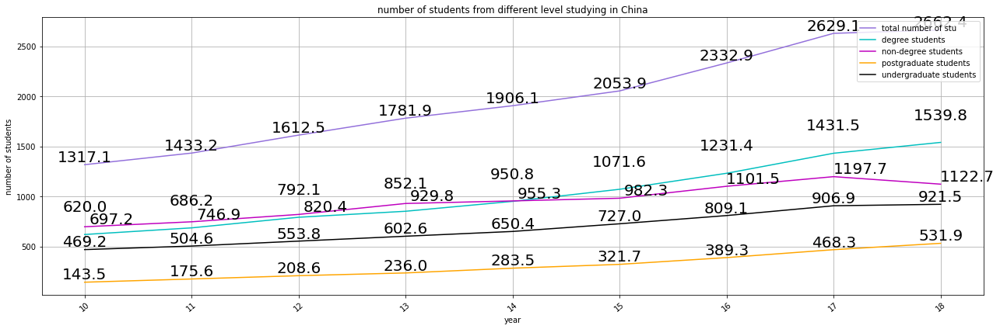
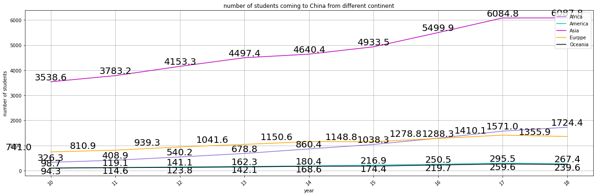
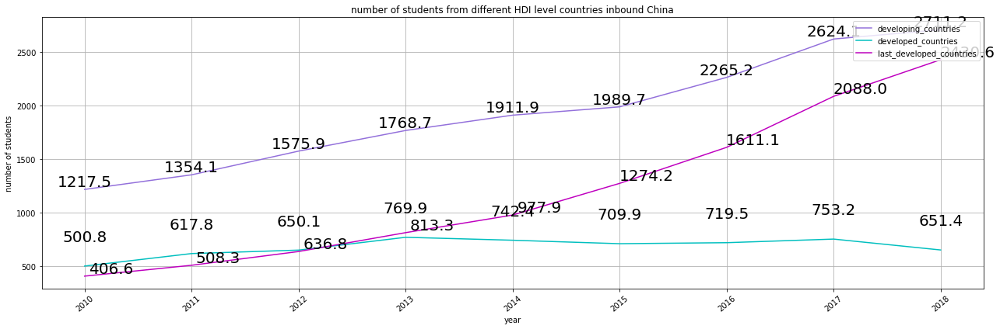
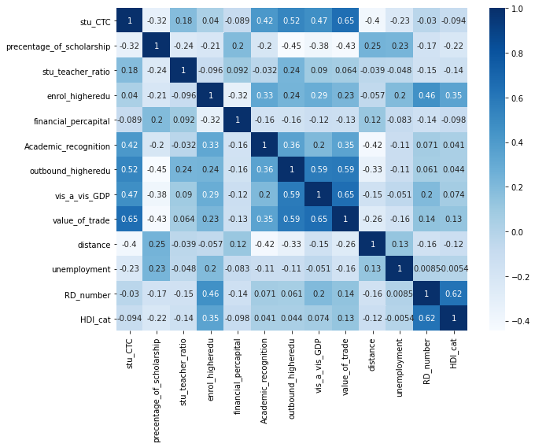
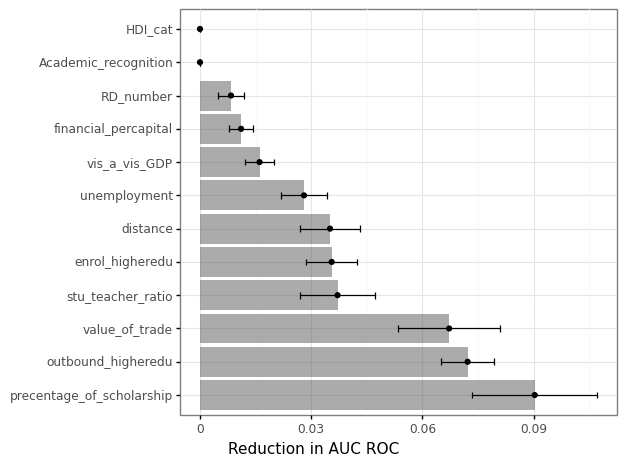
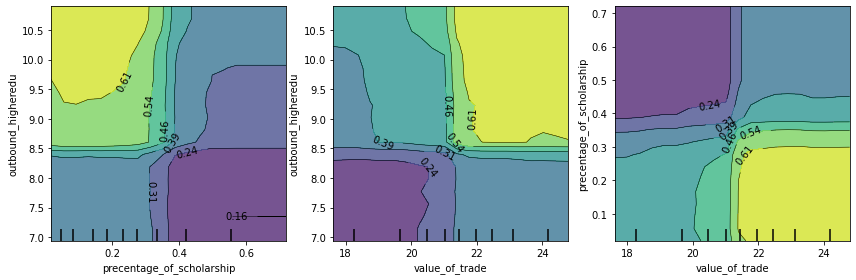
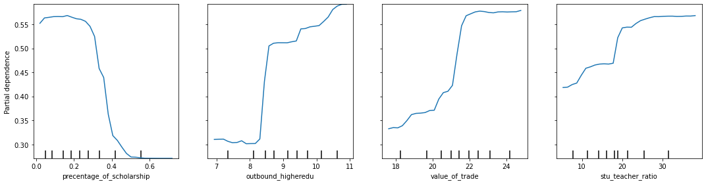

Machine learning on International Students Mobility: an example of China 

# introduction
With the further deepening of globalization, the international mobility of students is increasing.  My goals for this project are to examine which factors of a country are correlated with and predict international student mobility as measured through the number of students coming to study in a target country pursuing higher education. Due to its rising quality of higher education and increasing international influence, China is becoming a destination country for university students from many countries. Thus it is an ideal country to study international student mobility.

In the first section of this report, I contextualize the goals of this project by providing background and a problem statement of this project. In the following two sections, I outline the data collected and used and introduce the visualization and machine learning methodologies employed in the project. In the last two sections, I convey the insights of the research and discuss future analysis for the study. 

# Problem Statement and Background
In 2013, global student mobility totalled 4.1 million, and the number is soaring every year.  
International student mobility shows new characteristics in recent years, including a global rapidly increasing number of international students, international students between the importer and exporter of flow quantity disequilibrium phenomenon is outstanding, international students mainly from developing countries to developed countries. 

Research on international student mobility can be broadly divided into two dimensions: macro and micro. For the study of micro dimensions, Geoffrey N. Soutar and Julia P. Turner analyzed the effect of cultural, academic reputation, type of school, and quality of faculty at higher education institutions . Lawson Savery found that social ties will also have a significant impact, such as the presence of family or friends living in the destination country or whether family and friends have studied there before. 

Concerning the macro dimension, D.J. Bagne first used the basic theory of push-pull theory to explain population movement, and Philip G. Altbach, a U.S. comparative education expert, first applied this theory to study international student mobility. Mary E. McMahon's study of international students from 18 developing countries to the United States in the 1960s and 1970s found that economic, educational, and political factors in the destination country played an important role in international student mobility . Tse M. Chen and George A. Barnett used network analysis, learning that the amount of international student mobility worldwide is closely related to the level of economic development of both countries. 

The research question I explored in this project was: What feature contributes to its students being outbound to China? To contextualize this question, I first outline the current situation of Chinese students inbound to study, including the situation of students of different academic levels studying in China and the distribution of countries studying in China. In the second part on influencing factors of international students, the report employs a Random Forest model to evaluate the correlation between variables such as academic recognition, trade value between two countries and number of students inbound China. 

# Data
The data used for this project has been collected from several different sources. The unit of analysis is country-year, which observations from 141 countries beginning in 2010. All of the data was loaded into and manipulated with pandas. County names were standardized before merging using country-converter package. The countries included in this project are B&R countries. I narrowed my project to these countries because they have relatively stable diplomatic relations with China, so I control the influence of diplomatic factors on international students mobility to some extent. I collected the B&R country list from B&R official website.

## Dependent variable
The dependent variable for this project is the number of international students inbound China pursuing higher education. The data was sourced from the Concise Statistics of International Students Coming to China(2010-2018); since the books are only available in paper files, this part of the data is collected manually. It comprises data collected from all countries that have students inbound China to pursue tertiary education, including the number of degree students(comprising graduate students and post-graduate students) and non-degree students. 

## Independent Variables
My independent variables included both predictors and controls. I selected the predictors based on the “Push-Pull Theory”, these variables were collected from a respective online database, depicting the economic, social development level of a country and its higher education quality and quantity as the factors push students of their country to study in China. Education variables, including student-teacher ratio, higher education enrollment ratio and financial expenditure on each higher education student, indicate the higher education quality and the development standard of a country. I employed R&D researchers (per million people) to measure The advanced degree of society and GDP per capita to measure a country’s degree of economic development. I also employed HDI(Human Development Index) issued by the United Nations Development Program (UNDP) as a standard to categorize the B&R countries into three groups: developing countries, developed countered and least developed countries.

With respect of push factors, I select variables indicating the relationship between China and the dyad-country. Dimensions include economic cooperation, geographic distance, trade value between two countries and academic recognition. I collected the percentage of scholarships received by a country to study in China as an attraction to China from the Concise Statistics of International Students Coming to China (2010-2018). I collected the variable of Whether to sign mutual recognition of academic qualifications in China to To measure the closeness of education cooperation with China. Value of trade with China is employed to measure its economic closeness to China. I also employed geographic distance between B&R countries and China. The idea is that international students are more likely to study abroad in Neighboring countries, partly because of the cultural similarity.
Except for the predictors, I also introduce the number of people outbound as the control variable, indicating the mobility of a country’s population.

My initial step Is to collect these data via their respective channels and arrange the data based on the same standard(such as unitizing the country name). Then, I joined the data frame based on the unitized country name and dropped those countries with too much missing data. After that, I stored and managed the data frame by using SQLite. For my purpose, I use the GDP per capita of each country to divide the GDP per capita of China better present the economic gap between countries. I also merge the least developed country and developing country into one category to build a dummy variable of HDI, in which 1 presents developed country, which 0 presents less developed country.

# Analysis
I applied feature engineering, visualization, and modelling to conduct my analysis. After the initial data wrangling, I performed feature engineering to alter certain variables more appropriately for my analysis. This included dividing the variable of GDP per capita of B&R countries by the GDP per capita of China, which indicates the difference of economic gap between the two countries. In the same vein, I divided the number of students inbound China with government scholarship by the total number of students inbound china from that country. At the end of the wrangling, I had 1179 total entries for the years ranging from 2010 to 2018. 

The second method included visualization, which I employed throughout the project to both glean insights into the processed data through exploratory data analysis and to communicate my modelling results in a convenient way. In the exploratory data analysis part, I depict the status quo of international inbound students by using the data of 2018, so I have an updated display of the distribution of countries of origin.

```{r inbound based on countries, fig.align = 'center', out.width = "75%", fig.cap = "This figure shows the number of students coming from each country in 2018. From this graph, we can learn that the five countries with the most students studying in China are Pakistan, Korea, Thailand, Bangladesh and Lao People’s Democratic Republic. Interestingly, they are all neighbours of China, and we could see many other Asian countries rank at the top, while countries in America and Oceania have relatively less students..",echo=FALSE}

```


```{r inbound trend of different study level, fig.align = 'center', out.width = "75%", fig.cap = "This figure shows that the number of international degree students studying in China is in a rapidly increasing trend. Moreover, there is a stable increase in postgraduate students and undergraduate students year by year.",echo=FALSE}

```

```{r inbound trend of different continents, fig.align = 'center', out.width = "75%", fig.cap = "This figure shows that Asia is the continent that has the most students coming to study in China, Europe ranks second and then Africa. The continent of America and Oceania have the least students to come.",echo=FALSE}

```

```{r inbound based on countires of different HDI level, fig.align = 'center', out.width = "75%", fig.cap = "This figure shows that developing countries have the most students coming to study in China, last developed countries rank the second and have the fastest growth rate. The number of students from developed countries inbound China is the lowest, and there is no increasing trend.",echo=FALSE}

```

```{r corr, fig.align = 'center', out.width = "75%", fig.cap = "This figure shows the correlation between my independent variables.",echo=FALSE}

```

I then investigated the correlation between the predictor variables using the Seaborn packages. This table shows that there is less collinearity between the independent variables.

Lastly, I modelled my data using Scikit-learn machine learning techniques applicable to regression problems. I conduced two ways to analysis: regression and classification; firstly, i treated my dependent variable as a continuous variable as the original are, and applied regression model with OLS regression, K=Nearest Neighbors(KNN), and Decision Trees and Random Forests. Then, I classified my dependent variable by the mean of the data. In this case, I applied K=Nearest Neighbors(KNN), logit model and Random Forests to analysis. Before conducting the regression, I processed the dataset by dealing with categorical data types and highly skewed distributions through variable transformation. 

The first transformation was straightforward: I categorized the countries into two categories: developed countries and developing countries based on UNDP’s classification criteria. By visualizing the distributions of the variables, I found several variables were skewed, so I applied logarithmic transformation on them. Since the magnitude of the data varies widely, I scale these data by normalization before running my data through the machine learning pipeline. The second half of the modelling involved splitting my data into a test and training set, tuning parameters, and running the training data through my pipeline. I applied the GridSearchCV to find the estimates that led to the highest predictive accuracy. I the regression model, I used AUC ROC, the R-squared(R^2), while in the classification case, the predictive accuracy was measured by Mean Squared Error(MSE) and the R-squared(R^2). For KNN, this includes finding the ideal number of neighbouring data points to be evaluated, while for decision tree models, this includes determining the maximum branch depth and the number of predictors to be used as input.
 
I generated the pipeline once I had specified my estimators. This model was fitted to the test data and the predictive accuracy. I also permuted the features 15 times within the model. I plotted the reduction in AUC ROC attributed to each variable to generate a chart of variable importance for my research purpose of figuring out the different levels of influence the variables have on the dependent variable of the number of students inbound China for higher education. 

# Results
In the beginning, I ran several models based on counties from Asia and Africa(I picked these two continents for they possess more sufficient data). However, my initial experiments yielded very high MSE, which told me that I organized my data is not very predictive when employed in the pipeline. The features I choose cannot distinguish the counties in the same continent effectively. Countries in the same continent may share the more or less same distance to China and have similar economic and social situations, so when I run the model on counties in the same continent, a computer has very little information to learn from these features. Thus, I tuned my model by putting all the observations into model training.

In the regression model, my most successful model was KNN model, with 10 neighbors. When I fitted this model to my test data, it yielded the highest R square of 0.79 and a MSE of 0.682, which means on average, there is 0.682 unite error between the predicted value and the really value. This means that the variables selected perform pretty well in the process of predicting the number of international students inbound China. 

In the model of classification, random forests performed the best, with max depth of 6. When I fitted this model to my test data, it yielded the highest accuracy score of 0.97 and a ROC AUC score of 0.99. According to figure 6, we could see that the top three variables that have the most attribution to the prediction of Y are percentage of scholarship, number of one country’s outbound students and the value of trade between two countries. We could see that the impact of percentage of scholarship decreasing at the highest rate in its 0.2-0.4, and the effect of number of outbound international students surge at its 8-8.8. the effect of student-teacher ratio is relatively stable, comparing to other variables. According to figure 8, there is a complementary effect between these three variables. 
 
Figure 6: this figure shows the most consequential variables in the Random Forest model. 

```{r reduction in AUC ROC, fig.align = 'center', out.width = "75%", fig.cap = "This figure shows the most consequential variables in the Random Forest model",echo=FALSE}

```

```{r partial dependence, fig.align = 'center', out.width = "75%", fig.cap = "This figure shows the partial dependence of top four most predictive independent variables",echo=FALSE}

```

```{r partial dependence2, fig.align = 'center', out.width = "75%", fig.cap = "This figure shows the interactive partial dependence of three independent variables ",echo=FALSE}

```

# Discussion and Future Research
The study's success lies in the fact that I have succeeded in mapping the current situation of study in China in the Belt and Road countries, which includes the distribution of students at different levels of education. Although due to the complexity of the problem, it is not possible to fully predict the number of students coming to China by taking into account macro-level indicators such as the economic, social and educational development of a country and its relationship with China, we found different levels of impact of the variables covered in the study on the number of students coming to China.

In the future, I hope to use machine learning methods to predict the panel data, and adding the time dimension into consideration will improve the accuracy of the prediction. If I have more time, I will enrich my research by adding more dimensions to the data. Further, I would like to investigate how the factors influencing student mobility differ between countries with different economic development levels, such as the differences in the factors influencing students from developing countries to study in developing countries or move to developed countries. Moreover, I would like to visualize student mobility between countries with different levels of economic development.


# References

G.N.Soutar,J.P.Turner.Students' Preferences for University: A Conjoint Analysis[J]. International Journal of Educational Management, 2016(01):40-45.

C.Ziguras,S.Law.Recruiting International Students as Skilled Migrants: the Global ‘Skills Race’ as Viewed from Australia and Malaysia[J].Globalisation Societies & Education,2006,4(01):59-76.
  
M.E.McMahon.Higher Education in a World Market - an Historical Look at the Global Context of International Study[J]. Higher Education,1992,24(04):465-482

T.Chen,G.Barnett.A.Research on International Student Flows from a Macro Perspective: A Network Analysis of 1985,1989 and 1995 [J]. Higher Education,2000 (39):435-453.

